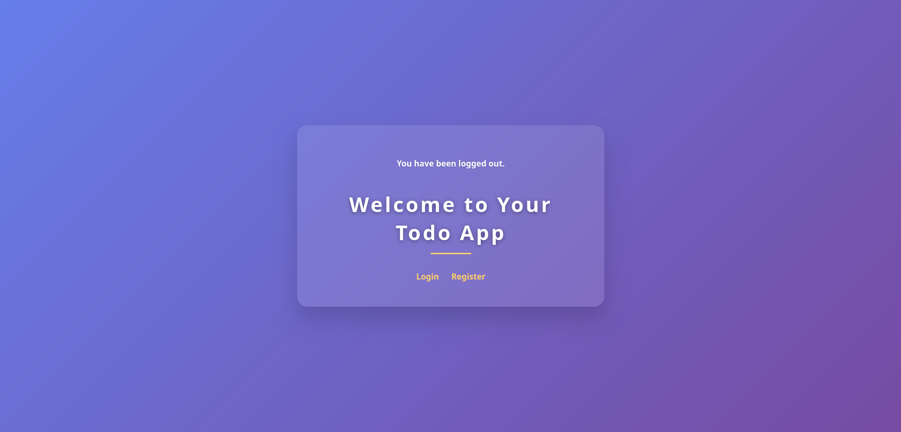
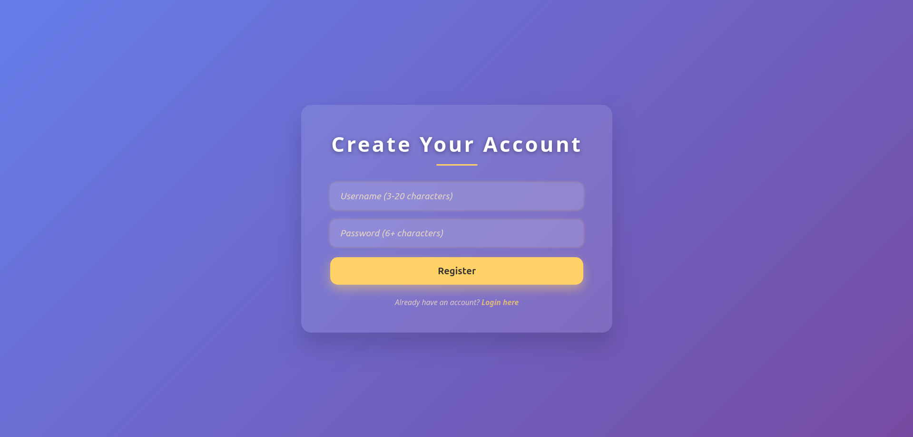
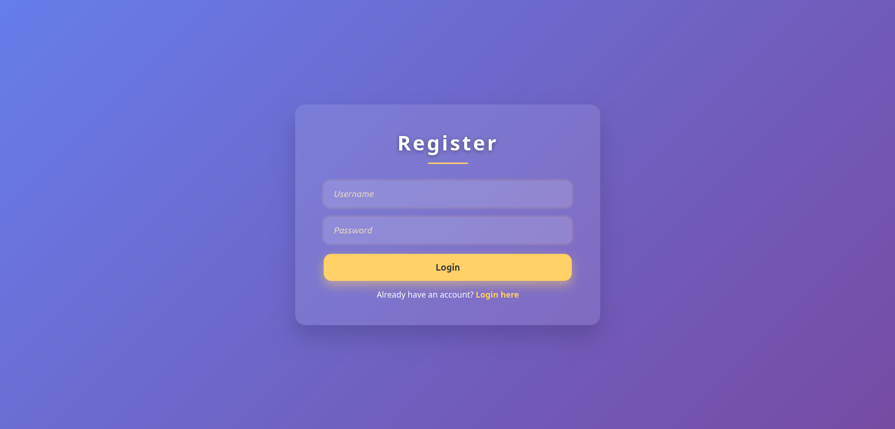
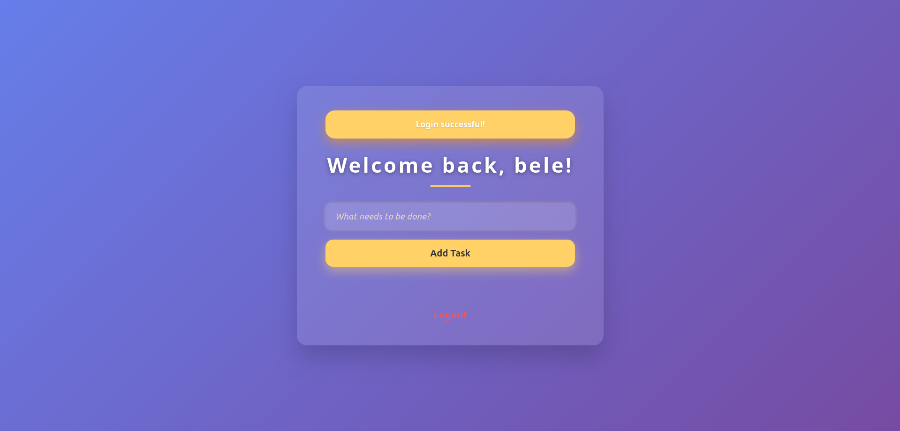

# Todo App con Flask

Esta es una aplicación web de lista de tareas (Todo App) construida con Flask, que permite a los usuarios registrarse, iniciar sesión, agregar y eliminar tareas, y proporciona una vista de administrador para ver usuarios y tareas registradas.
## Características

- Registro e inicio de sesión de usuarios

- Gestión de tareas personales (CRUD básico)

- Vista de administrador para ver todos los usuarios y tareas

- Interfaz sencilla con HTML/CSS (estático)

- Sistema de plantillas con Jinja2


## Project Structure

```
TODO FULL STACK/
│
├── .vscode/                   # Configuraciones de VS Code (si aplica)
├── __pycache__/               # Archivos compilados de Python (generados automáticamente)
├── instance/                  # Carpeta para instancias de Flask (configuraciones específicas)
├── static/
│   └── style.css              # Archivo CSS para estilos
├── templates/                 # Plantillas HTML
│   ├── admin_view.html        # Vista de administrador
│   ├── base.html              # Plantilla base
│   ├── dashboard.html         # Panel de control
│   ├── index.html             # Página de inicio
│   ├── login.html             # Página de inicio de sesión
│   └── register.html          # Página de registro
├── venv/                      # Entorno virtual de Python (dependencias aisladas)
│
├── app.py                     # Aplicación principal Flask (marcado con "2" en tu explorador)
├── database.db                # Base de datos SQLite (puede haber duplicado)
├── todo.db                    # Otra base de datos SQLite (posiblemente alternativa)
├── init_db.py                 # Script para inicializar la base de datos
├── manage.py                  # Script de gestión (posiblemente para Flask-Script)
└── README.md                  # Documentación del proyecto
```

##  Instalación del Proyecto Flask

# 1. Clona el repositorio
```
git clone <url-del-repositorio>
cd todo-flask-app
```

# 2. Crea y activa un entorno virtual:
```
python -m venv venv
source venv/bin/activate        # En macOS/Linux
venv\Scripts\activate           # En Windows
```

# 3. Instala las dependencias:
```
pip install -r requirements.txt
```
# 4. Crea el archivo de configuración:
Crea un archivo en instance/config.py con el siguiente contenido:
```
SECRET_KEY = "tu-clave-secreta"
SQLALCHEMY_DATABASE_URI = "sqlite:///../todo.db"
DEBUG = True
```
# 5. Ejecuta la aplicación:
```
flask --app run.py --debug run
```
# 6. Abre tu navegador en:
```
http://localhost:5000
```

## Captura pantalla
 <br><br>
<br><br>
<br><br>
<br><br>
